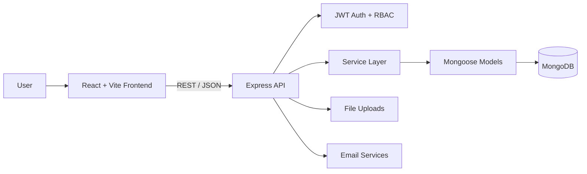

# 🚀 Project Management System

<div align="center">


**A full-stack project management workspace built with React, TypeScript, Node.js, Express and MongoDB.**

[Features](#-what-it-does) • [Architecture](#-architecture) • [Tech Stack](#-tech-stack) • [Getting Started](#-getting-started) • [API](#-api-overview) • [Permissions](#-permissions)

</div>

---

## ✨ What it does

This project brings a team's day-to-day project workflow into one workspace:

- 🔐 **Authentication** — registration, login, email verification, refresh tokens and password recovery
- 🗂️ **Projects** — create, view, update and manage projects
- 👥 **Team members** — add members and manage project-level roles
- ✅ **Tasks** — assign work, track status and manage attachments
- 🧩 **Subtasks** — break work into smaller pieces and track completion
- 📝 **Notes** — keep project-specific notes alongside the work
- 🛡️ **RBAC** — backend-enforced system and project permissions
- 📎 **File uploads** — multiple task attachments with metadata
- 🎨 **Frontend UI** — responsive React + Tailwind interface with a playful workspace aesthetic

### The workflow

```text
Authenticate
    ↓
Create / join a project
    ↓
Manage project members
    ↓
Create and assign tasks
    ↓
Break tasks into subtasks
    ↓
Track progress + keep notes
```

---

## 🏗️ Architecture



The repository is split into two independently runnable applications:

```text
project_management_system/
├── backend/
│   ├── src/
│   │   ├── controllers/     # HTTP request handlers
│   │   ├── middlewares/     # Auth, validation & permissions
│   │   ├── models/          # Mongoose data models
│   │   ├── routes/          # API route definitions
│   │   ├── services/        # Business logic
│   │   └── utils/            # Shared backend utilities
│   ├── PRD.md
│   └── package.json
│
├── frontend/
│   ├── src/
│   │   ├── api/              # API clients
│   │   ├── components/       # Reusable UI
│   │   ├── context/          # App state
│   │   ├── hooks/            # Reusable React logic
│   │   ├── pages/            # Application screens
│   │   ├── routes/           # Route configuration
│   │   └── types/            # TypeScript types
│   └── package.json
│
└── README.md
```

---

## 🧰 Tech Stack

| Layer | Technologies |
|---|---|
| **Frontend** | React 19, TypeScript, Vite, React Router, Axios, Tailwind CSS 4 |
| **Backend** | Node.js, Express 5, TypeScript |
| **Database** | MongoDB, Mongoose |
| **Authentication** | JWT, refresh tokens, bcrypt |
| **Validation** | Zod |
| **Email** | Nodemailer, Mailgen |
| **Uploads** | Multer |
| **Logging** | Winston |

---

## 🔐 Permissions

The API uses both **system roles** and **project-level roles**.

| Capability | Admin | Project Admin | Member |
|---|:---:|:---:|:---:|
| Create projects | ✅ | — | — |
| Update/delete projects | ✅ | — | — |
| Manage project members | ✅ | — | — |
| Create/update/delete tasks | ✅ | ✅ | — |
| View tasks | ✅ | ✅ | ✅ |
| Update subtask status | ✅ | ✅ | ✅ |
| Create/delete subtasks | ✅ | ✅ | — |
| Create/update/delete notes | ✅ | — | — |
| View notes | ✅ | ✅ | ✅ |

> Permissions are enforced in the backend, not only hidden in the frontend.

---

## 🔌 API Overview

Base path:

```text
/api/v1
```

| Area | Purpose |
|---|---|
| `/auth` | Registration, login, verification, password & token flows |
| `/projects` | Project and member management |
| `/tasks` | Tasks, assignments, attachments & subtasks |
| `/notes` | Project notes |
| `/healthcheck` | API health status |

The backend PRD contains the detailed endpoint and permission specification:

**[→ View backend/PRD.md](./backend/PRD.md)**

---

## 🚦 Getting Started

### Prerequisites

- Node.js
- MongoDB
- SMTP credentials for email features

### 1. Clone

```bash
git clone https://github.com/iamsyedbilal/project_management_system.git
cd project_management_system
```

### 2. Start the backend

```bash
cd backend
npm install
npm run dev
```

Create a `.env` file with your MongoDB, JWT and SMTP configuration.

The development API runs on:

```text
http://localhost:8000
```

### 3. Start the frontend

Open another terminal:

```bash
cd frontend
npm install
npm run dev
```

Vite will print the local frontend URL in your terminal.

---

## 🔒 Engineering & Security

The backend is structured around separated **routes → controllers → services → models**, with middleware handling cross-cutting concerns.

Security-related implementation includes:

- JWT access/refresh token flow
- Protected API routes
- Role-based authorization
- Project-level permission checks
- Password hashing
- Email verification and password reset flows
- Request validation with Zod
- Controlled file uploads with Multer
- CORS configuration
- Centralized logging with Winston

---

## 🎨 Frontend Direction

The UI intentionally moves away from a generic CRUD dashboard and uses a more energetic workspace style:

- 💜 Violet / fuchsia visual language
- ✨ Subtle motion and visual accents
- 🪩 Rounded cards and friendly interactions
- 🔤 Space Grotesk + DM Sans typography
- 📱 Responsive layouts
- 🎯 Clear status and role indicators

---

## 📌 Project Status

**Active development.**

The core authentication, project, member, task, subtask and notes workflows are implemented across the backend and frontend. The repository is being refined toward a more production-ready full-stack application.

---

## 🗺️ Roadmap

- [ ] Automated backend test suite
- [ ] Frontend component / integration tests
- [ ] CI checks for linting and builds
- [ ] Production deployment
- [ ] API documentation / OpenAPI specification
- [ ] More advanced project analytics

---

## 👤 Author

**Syed Bilal**

Building full-stack applications with TypeScript, React, Node.js and modern backend architecture.

---

<div align="center">

**Turn scattered work into one organized workspace. 🚀**

⭐ If you find the project useful, consider giving it a star.

</div>
